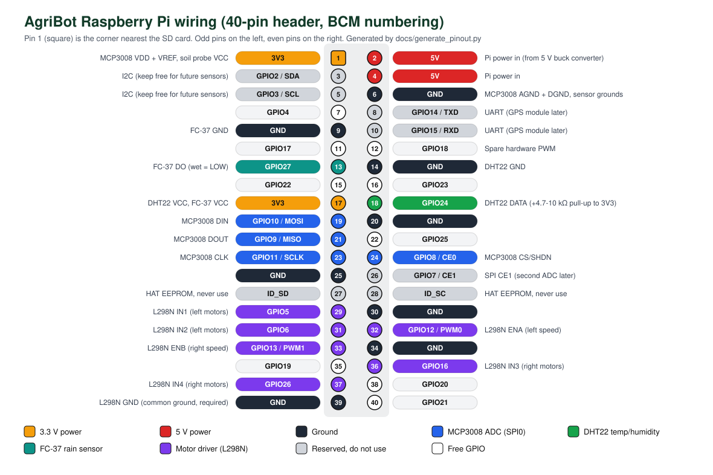
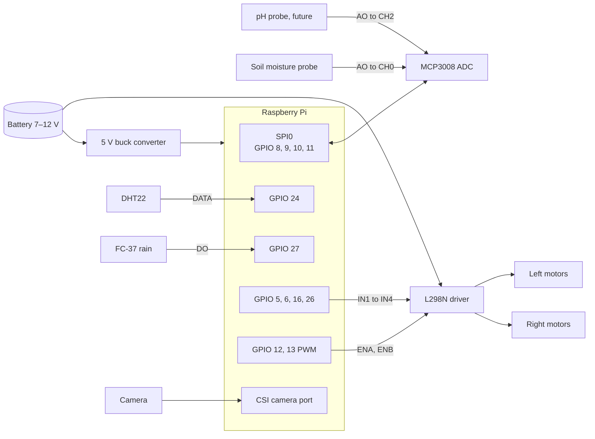

# AgriBot Raspberry Pi pin mapping

This is the wiring for every module on the AgriBot Raspberry Pi: sensors, the analog-to-digital converter, the motor driver and power. AgriBot uses a **Raspberry Pi 5**. The 40-pin header is the same as on the Pi 3B+ and 4, so the mapping also works on those boards. Pins use **BCM GPIO numbers**, which is what the code uses, alongside the **physical header pin**.



> **Motor driver pins need checking.** The motors are driven by a separate script, `ps5.py`, that lives only on the Pi and is not in this repository. The L298N mapping below is a recommended layout that avoids every sensor pin and uses the Pi's hardware PWM pins for speed. If your `ps5.py` uses different pins, either rewire to this layout or edit `PINS` in [generate_pinout.py](generate_pinout.py) and run it again.

## Safety rules

1. **Raspberry Pi GPIO is 3.3 V only.** Never connect a 5 V signal to a GPIO pin. Pi pins have no analog inputs, so analog sensors go through the MCP3008.
2. **Power sensors from 3V3, not 5V**, whenever their output goes to the Pi or the MCP3008.
3. **Never power motors from the Pi.** Motors draw several amps and create electrical noise. They get their own battery through the L298N.
4. **Connect all grounds together.** Pi GND, L298N GND, battery negative and sensor grounds must be joined, or the motor driver will not read the Pi's signals reliably.
5. **Do not use the L298N's 5 V output to power the Pi.** Its regulator browns out under motor load. The Pi 5 needs a 5 V / 5 A (25 W) buck converter from the battery, into the USB-C port or pins 2 and 4. With only 3 A it still boots, but it limits USB current, which can starve a USB webcam.

## Sensors

| Module | Module pin | Goes to | Physical pin | BCM | Notes |
| --- | --- | --- | ---: | --- | --- |
| MCP3008 ADC | VDD, VREF | Pi 3V3 | 1 | — | 3.3 V reference, so analog inputs must stay at 0–3.3 V |
| MCP3008 ADC | AGND, DGND | Pi GND | 6 | — | |
| MCP3008 ADC | CLK | Pi SCLK | 23 | GPIO 11 | SPI0, enable with `raspi-config` |
| MCP3008 ADC | DOUT | Pi MISO | 21 | GPIO 9 | |
| MCP3008 ADC | DIN | Pi MOSI | 19 | GPIO 10 | |
| MCP3008 ADC | CS/SHDN | Pi CE0 | 24 | GPIO 8 | |
| Capacitive soil moisture | VCC / GND | Pi 3V3 / GND | 1 / 6 | — | Share pin 1 and pin 6 via the breadboard rails |
| Capacitive soil moisture | AO | MCP3008 **CH0** | — | — | `SOIL_ADC_CHANNEL=0` |
| pH probe (future) | AO | MCP3008 **CH2** | — | — | `PH_ADC_CHANNEL=2`. Check its output never exceeds 3.3 V. |
| DHT22 | VCC / GND | Pi 3V3 / GND | 17 / 14 | — | |
| DHT22 | DATA | Pi GPIO | 18 | GPIO 24 | `DHT_PIN=24`. Add a 4.7–10 kΩ pull-up from DATA to 3V3 unless the breakout has one. |
| FC-37 rain module | VCC / GND | Pi 3V3 / GND | 17 / 9 | — | |
| FC-37 rain module | DO | Pi GPIO | 13 | GPIO 27 | `RAIN_DO_PIN=27`. Reads LOW when wet (`RAIN_WET_DIGITAL_VALUE=0`). |
| FC-37 rain module | AO | not connected | — | — | The service uses the digital wet/dry output only |
| Camera | Ribbon | CAM/DISP 0 port | — | — | The Pi 5 uses a narrower 22-pin connector, so older camera modules need a 22-to-15-pin ribbon. A USB webcam also works. `CAMERA=auto` tries both. |

All 3V3 pins (1 and 17) are the same supply, and all GND pins are the same ground. Spreading modules across them just keeps the wiring tidy.

## Motor driver (L298N, two channels)

This suits a 4-wheel robot with skid steering. Wire the two left motors in parallel on channel A and the two right motors on channel B. **Remove the ENA and ENB jumpers** on the L298N so the Pi controls speed with PWM.

| L298N pin | Goes to | Physical pin | BCM | Purpose |
| --- | --- | ---: | --- | --- |
| ENA | Pi PWM0 | 32 | GPIO 12 | Left motor speed (hardware PWM) |
| IN1 | Pi GPIO | 29 | GPIO 5 | Left direction A |
| IN2 | Pi GPIO | 31 | GPIO 6 | Left direction B |
| ENB | Pi PWM1 | 33 | GPIO 13 | Right motor speed (hardware PWM) |
| IN3 | Pi GPIO | 36 | GPIO 16 | Right direction A |
| IN4 | Pi GPIO | 37 | GPIO 26 | Right direction B |
| GND | Pi GND **and** battery − | 39 | — | Common ground, required |
| +12V (VS) | Battery + (7–12 V) | — | — | Motor supply. Put a switch and fuse inline. |
| +5V | not connected | — | — | Leave the 5V-EN jumper on so the board powers its own logic |
| OUT1 / OUT2 | Left motors | — | — | Swap the wires if the left side runs backwards |
| OUT3 / OUT4 | Right motors | — | — | Swap the wires if the right side runs backwards |

The L298N treats any input above 2.3 V as HIGH, so the Pi's 3.3 V signals drive it directly with no level shifter.

| IN1 | IN2 | ENA | Left side |
| :-: | :-: | :-: | --- |
| 1 | 0 | PWM | Forward |
| 0 | 1 | PWM | Reverse |
| 0 | 0 | — | Coast |
| 1 | 1 | — | Brake |

Channel B works the same way with IN3, IN4 and ENB.

If you later switch to a **TB6612FNG**, which runs cooler and wastes less battery, use the same pins: PWMA on GPIO 12, AIN1 on GPIO 5, AIN2 on GPIO 6, PWMB on GPIO 13, BIN1 on GPIO 16, BIN2 on GPIO 26. Add STBY on GPIO 25 (pin 22), tied HIGH.

## Power

```text
 Battery 7–12 V ──┬── fuse ── switch ──► L298N +12V (VS) ──► motors
                  │
                  └──► 5 V / 5 A buck converter ──► Pi 5 USB-C  (or pins 2 / 4)

 Battery − ── L298N GND ── Pi GND (pin 39) ── all sensor grounds
```

## Connection diagram



## Full 40-pin header

<!-- PIN-TABLE:START -->
| Pin | Name | Connects to | | Pin | Name | Connects to |
|---:|---|---|---|---:|---|---|
| 1 | 3V3 | MCP3008 VDD + VREF, soil probe VCC | | 2 | 5V | Pi 5 power in (5 V / 5 A buck converter) |
| 3 | GPIO2 / SDA | I2C (keep free for future sensors) | | 4 | 5V | Pi power in |
| 5 | GPIO3 / SCL | I2C (keep free for future sensors) | | 6 | GND | MCP3008 AGND + DGND, sensor grounds |
| 7 | GPIO4 | — | | 8 | GPIO14 / TXD | UART (GPS module later) |
| 9 | GND | FC-37 GND | | 10 | GPIO15 / RXD | UART (GPS module later) |
| 11 | GPIO17 | — | | 12 | GPIO18 | Spare hardware PWM |
| 13 | GPIO27 | FC-37 DO (wet = LOW) | | 14 | GND | DHT22 GND |
| 15 | GPIO22 | — | | 16 | GPIO23 | — |
| 17 | 3V3 | DHT22 VCC, FC-37 VCC | | 18 | GPIO24 | DHT22 DATA (+4.7-10 kΩ pull-up to 3V3) |
| 19 | GPIO10 / MOSI | MCP3008 DIN | | 20 | GND | — |
| 21 | GPIO9 / MISO | MCP3008 DOUT | | 22 | GPIO25 | — |
| 23 | GPIO11 / SCLK | MCP3008 CLK | | 24 | GPIO8 / CE0 | MCP3008 CS/SHDN |
| 25 | GND | — | | 26 | GPIO7 / CE1 | SPI CE1 (second ADC later) |
| 27 | ID_SD | HAT EEPROM, never use | | 28 | ID_SC | HAT EEPROM, never use |
| 29 | GPIO5 | L298N IN1 (left motors) | | 30 | GND | — |
| 31 | GPIO6 | L298N IN2 (left motors) | | 32 | GPIO12 / PWM0 | L298N ENA (left speed) |
| 33 | GPIO13 / PWM1 | L298N ENB (right speed) | | 34 | GND | — |
| 35 | GPIO19 | — | | 36 | GPIO16 | L298N IN3 (right motors) |
| 37 | GPIO26 | L298N IN4 (right motors) | | 38 | GPIO20 | — |
| 39 | GND | L298N GND (common ground, required) | | 40 | GPIO21 | — |
<!-- PIN-TABLE:END -->

## Software settings that must match the wiring

| Setting in `/etc/agribot.env` | Value | Wired to |
| --- | --- | --- |
| `DHT_PIN` | `24` | DHT22 DATA, pin 18 |
| `RAIN_DO_PIN` | `27` | FC-37 DO, pin 13 |
| `RAIN_WET_DIGITAL_VALUE` | `0` | Set to `1` if your module reads HIGH when wet |
| `SOIL_ADC_CHANNEL` | `0` | MCP3008 CH0 |
| `PH_ADC_CHANNEL` | `2` | MCP3008 CH2 |
| `CAMERA` | `auto` | CSI ribbon, or USB webcam at `CAMERA_INDEX` |

SPI must be enabled with `sudo raspi-config nonint do_spi 0`. The install script does this.

## Bench test before driving

Run these on the Pi with the wheels off the ground.

```bash
pinout                                   # prints this Pi's header layout
curl http://localhost:8000/sensors       # all sensors through the AgriBot service
curl http://localhost:8000/sensors/dht22
```

```python
# Motor check: each side should spin forward, then reverse, at half speed.
from time import sleep
from gpiozero import Motor

left = Motor(forward=5, backward=6, enable=12)
right = Motor(forward=16, backward=26, enable=13)
for motor in (left, right):
    motor.forward(0.5); sleep(1)
    motor.backward(0.5); sleep(1)
    motor.stop()
```

If a side spins the wrong way, swap that side's two motor wires on OUT1/OUT2 or OUT3/OUT4. Do not change the GPIO pins.

## Updating this document

The diagram and the header table are generated from one list:

```bash
python3 docs/generate_pinout.py
```
